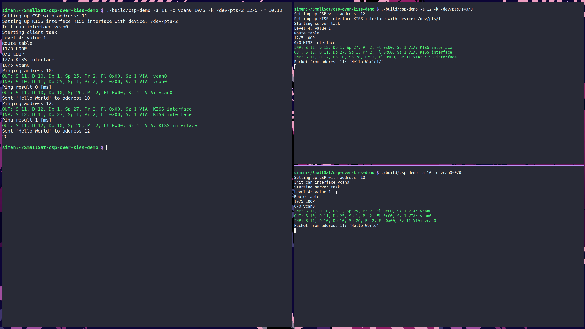

# csp-over-kiss-demo
This repository contains a demonstration of Cubesat Protocol over Serial with KISS.
It is implemented using [libcsp](https://github.com/NTNU-SmallSat-Lab/libcsp) and communicating over virtual serial-ports.

The demonstration contains two programs, a server and a client. The client sends messages over KISS to the server, and the server displays the received message.

## Dependencies:
To build this demonstration, you need:
- [libcsp](https://github.com/NTNU-SmallSat-Lab/libcsp)
- [libsocketcan](https://github.com/lalten/libsocketcan)
- git
- gcc
- make
- socat (for creating virtual serial ports)

## Install libraries
Before you try to build this example, make sure you install libsocketcan and libcsp correctly.
These libraries are included as git submodules and can be built as described here, or the Makefile can be edited to look for them elsewhere.

Before building these libraries, make sure they are downloaded, by running 
```bash
git submodule update --init
```

### libsocktecan

To install libsocketcan, first make sure you have the build dependencies installed:
- autoconf
- automake
- libtools

Now you can navigate to the root folder of this repository and run these commands:
```bash
cd libsocketcan
bash autogen.sh
mkdir -p build
./configure --prefix=$PWD/build
mv README.md README # small fix for an error i met in makefile
make
make install
cd ..
```

### libcsp

First step is to make sure you have the build dependency:
- python 2.7

Then you can install libcsp, navigate to the root folder of this repository and run these commands:
```bash
cd libcsp
python waf configure --out=./build                     \
                     --prefix=./build                  \
                     --include=../libsocketcan/include \
                     --install-csp                     \
                     --enable-crc32                    \
                     --enable-init-shutdown            \
                     --enable-if-kiss                  \
                     --enable-if-can                   \
                     --enable-can-socketcan            \
                     --enable-promisc                  \
                     --with-os=posix                   \
                     --with-rtable=cidr                \
                     --with-driver-usart=linux         \
                     --with-driver-tcp=linux
python waf build install
cd ..
```

## Build:
To build this demonstration, navigate to the root directory of this repository and run
```bash
make
```

## Run demonstration:
To run the demonstration, make sure both the server and client is built correctly.
Running the example is done by these three steps:
- Open pseudo-serial port with socat
	- `socat -d -d pty,rawer pty,rawer`
- Open virtual can
  - `sudo ip link add vcan0 type vcan`
  - `sudo ip link set vcan0 up`
- Start servers, listening for messages (choose between can, kiss or both)
	- `./build/csp-demo -a <address> -k <kiss-device=address/mask> -c <can-device=address/mask>`
- Start client, sending messages to list of servers (separated with comma, no space)
	- `./build/csp-demo -a <address> -k <kiss-device=address/mask> -c <can-device=address/mask> -r <address,address>`

Here is an example where the opened ports are `/dev/pts/1` and `/dev/pts/2`:
First set up virtual can and serial ports (this requires sudo):
```bash
sudo ip link add vcan0 type vcan
sudo ip link set vcan0 up
socat -d -d pty,rawer pty,rawer &
```
Now we can run our example:
```bash
./build/csp-demo -a 8 -k /dev/pts/1=0/0 &
./build/csp-demo -a 19 -c vcan0=0/0 &
./build/csp-demo -a 9 -k /dev/pts/2=0/1 -c vcan0=16/1 -r 8,19
```

Here is an image from a local run of the demonstration with vcan0 and virtual serial ports /dev/pts/1 and /dev/pts/2.
In this demonstration the client (left) sends messages to address 10 (lower right) and 12 (upper right).
